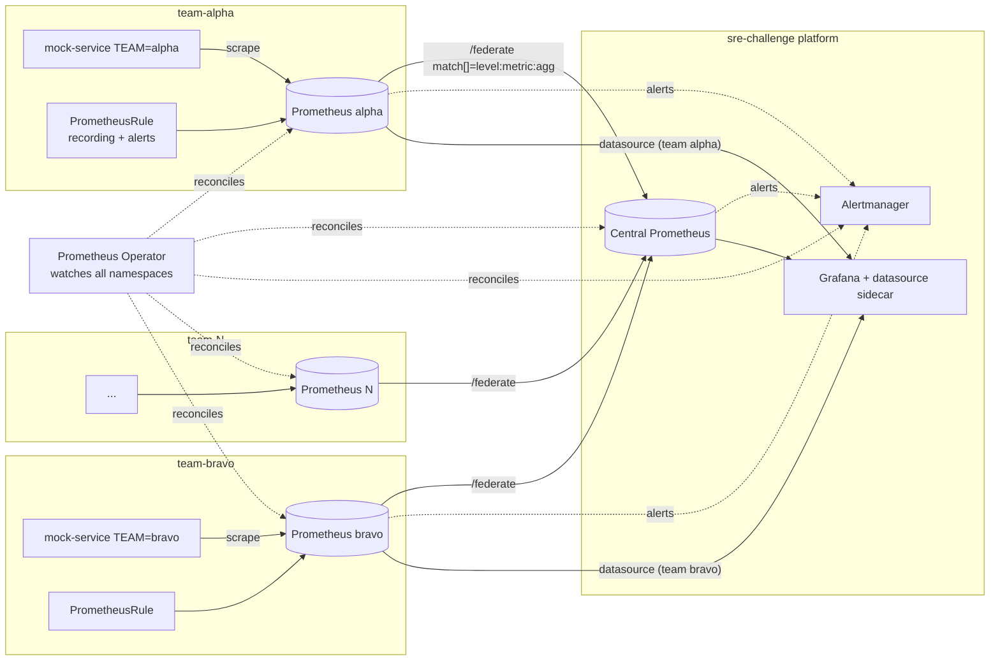
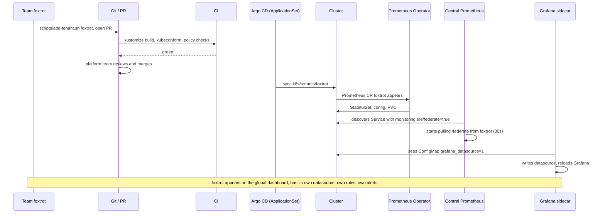

# Task 2: Per-team Prometheus with automated tenant management and federated queries

## Requirements

- Each team (alpha, bravo, charlie, delta, echo) runs its own Prometheus so
  it can write queries and alerts without affecting other teams.
- Management gets one dashboard with request rates across all teams.
- Adding a team must be automated and repeatable.

## Design in one picture



## How it works

### Tenant isolation (per-team Prometheus)

Everything a tenant owns lives in `team-<name>` and carries the label
`tenant: <name>`:

| Object | Purpose |
|--------|---------|
| `Namespace team-<name>` | boundary for RBAC, quotas, discovery |
| `Prometheus <name>` | operator-managed StatefulSet with 2Gi PVC, 512Mi limit, sample and label limits |
| `Role` + `RoleBinding` | the tenant Prometheus can only list services, endpoints and pods in its own namespace |
| `ServiceMonitor` (app, self) | what the tenant scrapes; selected by `tenant` label |
| `PrometheusRule tenant-rules` | the team's recording and alerting rules |
| `Service prometheus` with `monitoring.sre/federate: "true"` | federation endpoint discovered by the central Prometheus |
| `ConfigMap grafana-datasource-<name>` with `grafana_datasource: "1"` | the team's datasource in the shared Grafana |

The Prometheus CR uses `serviceMonitorNamespaceSelector`,
`ruleNamespaceSelector` and friends restricted to `tenant: <name>`, so a
team cannot accidentally (or deliberately) scrape another team's pods or
load rules into another team's server. `externalLabels.tenant` stamps the
team on every series that leaves the instance.

Resource limits, retention and cardinality guard rails are identical for
all tenants because they come from the template. Raising a budget is a
change to the tenant directory that the platform team reviews.

### Federated queries (management view)

The central Prometheus in `sre-challenge` has one extra ServiceMonitor,
`tenant-federation`:

```yaml
namespaceSelector: { any: true }
selector: { matchLabels: { monitoring.sre/federate: "true" } }
endpoints:
  - port: web
    path: /federate
    honorLabels: true
    params:
      "match[]":
        - '{__name__=~"[a-z_]+:[a-z_]+:[a-z0-9_]+"}'
        - '{__name__="up"}'
```

Two deliberate choices:

1. **Discovery by label across all namespaces.** A new tenant's Service
   shows up as a federation target within one scrape interval. Nothing in
   the central namespace is touched when a tenant is added.
2. **Only recording-rule output crosses the boundary.** The `match[]`
   selector accepts series named `level:metric:aggregation`, the
   Prometheus naming convention for recording rules. Tenants control what
   they publish by adding recording rules; the central server can never be
   flooded by a tenant's raw series. The cardinality incident from task 1
   cannot propagate upward.

The federation contract today:

| Recording rule | Used for |
|----------------|----------|
| `team:service_request:rate5m` | management request-rate dashboard |
| `team_service:service_request:rate5m` | per service breakdown |
| `team_service:service_request_duration_seconds:p95_5m` | latency across teams |
| `team:prometheus_tsdb_head_series:sum` | per-tenant series budget alert |

The central Prometheus alerts on `TenantFederationDown`,
`TenantFederationStale` and `TenantSeriesBudgetHigh`, so the platform
team learns about a broken or overloaded tenant before the tenant does.

The "Global Overview - All Tenants" Grafana dashboard reads only from the
central datasource and groups by the `tenant` label.

### Shared Grafana, per-team datasources

Grafana gets a `kiwigrid/k8s-sidecar` container that watches every
namespace for ConfigMaps labelled `grafana_datasource=1`, writes them to
the provisioning directory and calls Grafana's provisioning reload API.
Each tenant directory ships one such ConfigMap, so onboarding a tenant
also creates its datasource "Prometheus (team alpha)" with no change to
the Grafana deployment. The central datasource is delivered the same way,
so there is one mechanism, not two.

Dashboards can use the identical pattern (`grafana_dashboard=1` ConfigMaps
and a second sidecar) if teams want to ship their own dashboards. Grafana
folders and team permissions would then map 1:1 to tenants.

### Alerting

All Prometheus instances send to the one Alertmanager in `sre-challenge`.
Alerts carry the `tenant` external label, so Alertmanager routes can fan
out per team (`match: tenant: alpha` to the alpha on-call receiver), while
platform alerts go to the platform rotation. The `AlertmanagerConfig` CRD
(added in task 1) lets each team manage its own routes and receivers from
its own namespace without editing the shared config.

## Adding a new tenant

Everything is a directory in git rendered from one template:

```
k8s/tenants/
  _template/        the only thing humans edit
  alpha/            rendered, committed, applied
  bravo/
  ...
  kustomization.yaml  aggregates all tenants (maintained by the script)
```



Locally, without GitOps, the same flow is:

```bash
scripts/add-tenant.sh foxtrot --apply
```

which renders `k8s/tenants/foxtrot/`, updates the aggregate
kustomization, applies it and waits for the StatefulSet. Within 30
seconds the central Prometheus federates from it and Grafana has the new
datasource. Removing a tenant is `git rm -r k8s/tenants/foxtrot` plus a
sync; Argo CD prunes the namespace and the PVC goes with it.

### Tooling choices and why

| Concern | Choice | Why |
|---------|--------|-----|
| Prometheus lifecycle | Prometheus Operator CRDs | already in the stack; declarative; teams get ServiceMonitor and PrometheusRule as a self-service API |
| Templating | Kustomize + a `sed`-rendered template | zero extra dependencies, output is plain YAML you can read in a PR. A Helm chart (`helm template tenant ...`) is the natural next step once values diverge per tenant |
| Delivery | Argo CD ApplicationSet with a directory generator over `k8s/tenants/*` | one PR per tenant, automatic sync, pruning, drift detection, audit trail |
| CI gates | `kustomize build`, `kubeconform` with the operator CRD schemas, a policy check (Kyverno or conftest) that rejects a Prometheus CR without limits or storage | keeps the guard rails from task 1 mandatory |
| Cross-tenant queries | Prometheus federation of recording rules | simplest thing that works, bounded by construction |
| Datasource automation | Grafana ConfigMap sidecar | standard pattern (kube-prometheus-stack uses it), no Grafana API scripting |

## Where this design stops and what comes next

Federation was chosen because it is native, needs no new components and
is enough for "request rates across all teams". Its limits:

- Each federation scrape is a point-in-time copy. Resolution is the
  federation interval, and there is no way to query a tenant's raw data
  from the centre. If management wants ad-hoc drill-down, use **Thanos
  Query** (a Querier fanning out to a Thanos sidecar next to every tenant
  Prometheus) or **Grafana Mimir** with one tenant ID per team. Both keep
  a single global query endpoint and add object-storage long-term
  retention, which also removes "Prometheus ran out of disk" as a failure
  mode for good. The tenant directory structure does not change; the
  Prometheus CR gains a `thanos:` block or a `remoteWrite:` target.
- The central Prometheus is a single point of failure for the management
  view (tenants keep working without it). `replicas: 2` on the central CR
  is the cheap fix.
- Grafana itself is shared. Real multi-tenancy at the Grafana layer means
  one org or one folder per team with datasource permissions, which is a
  Grafana Enterprise feature for datasource-level isolation; on OSS,
  folders plus teams plus `editable: false` datasources is the pragmatic
  setup.
- Alertmanager is shared. Per-tenant `AlertmanagerConfig` objects give
  teams their own routes; if noisy neighbours become an issue, the
  template can grow an `Alertmanager` per tenant with the same pattern.

## Verification (measured on the kind cluster)

After `./setup.sh` with five tenants, then `scripts/add-tenant.sh foxtrot --apply`:

| Check | Result |
|-------|--------|
| Federation targets in central Prometheus | alpha, bravo, charlie, delta, echo, foxtrot: all `up` |
| `sum by (tenant) (team:service_request:rate5m)` | 25 to 31 req/s per tenant, 142 req/s total |
| Samples pulled per federation scrape | 2 to 10 per tenant (recording-rule output only) |
| Active series per tenant Prometheus | about 650 to 720 |
| Team alpha Prometheus: `label/team/values` | `["alpha"]` only |
| Team alpha Prometheus: scrape targets | `mock-service` and `prometheus` in `team-alpha` only |
| Grafana datasources | `Prometheus` plus one per tenant, foxtrot's appeared without touching Grafana |
| Time from `add-tenant.sh foxtrot --apply` to federated target `up` | about 90 seconds |
| PVCs | 5Gi central, 2Gi per tenant, all Bound |


```bash
kubectl get prometheus -A
kubectl get svc -A -l monitoring.sre/federate=true

# federation targets in the central Prometheus
curl -s localhost:9090/api/v1/targets | jq -r '.data.activeTargets[] | select(.labels.job=="federate") | "\(.labels.tenant_namespace) \(.health)"'

# request rate per tenant, from federated data
curl -s 'localhost:9090/api/v1/query?query=sum%20by%20(tenant)%20(team:service_request:rate5m%7Btenant!%3D%22%22%7D)' | jq '.data.result[] | [.metric.tenant, .value[1]]'

# tenant datasources in Grafana
curl -s -u admin:admin localhost:3000/api/datasources | jq -r '.[].name'

# tenant Prometheus only sees its own namespace
kubectl port-forward -n team-alpha svc/prometheus 19090:9090 &
curl -s localhost:19090/api/v1/label/team/values
```
